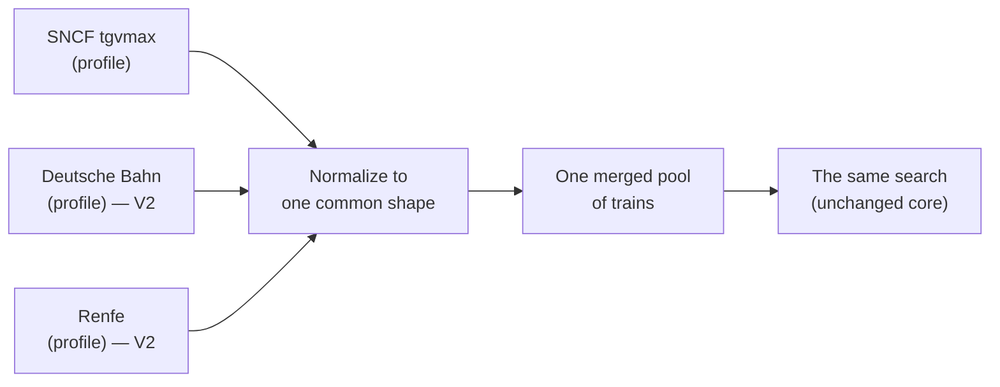

# Vision — MAX Finder

Where MAX Finder is today, and where it's headed. For the day-to-day of *how it
works now*, see [`docs/how-it-works.md`](docs/how-it-works.md) and
[`docs/algorithms.md`](docs/algorithms.md). The non-negotiable principles live in
[`specs/constitution.md`](specs/constitution.md).

---

## Today (V1): SNCF, done well

MAX Finder finds SNCF trains where a free **MAX JEUNE / MAX SENIOR** seat is
reservable, from SNCF open data — Where to?, Where from?, Exact trip, Tour, Ideas,
round trips and night trains, all serverless and account-free. **This is and stays
the heart of the app**, and the branding stays SNCF / MAX.

The data layer already has the seam V2 builds on: a **`DatasetProfile`**
(`src/data/profile.ts`) that holds everything about *reading and judging one
dataset* (field mapping, the "is this seat bookable?" rule, hubs, non-bookable
stops). The core search only ever sees the neutral, normalized train shape.

---

## V2 (shipped): trains beyond France 🇫🇷 → 🇪🇺

Add other countries' trains — **Germany (Deutsche Bahn), Spain (Renfe), …** — so one
app covers more of Europe. SNCF remains the centre; other networks are added as
**extra data sources merged into the same search**, not a rewrite. A traveller
should be able to plan a trip that crosses a border without leaving the app.

### Why it's within reach

The core algorithms (search, connections, round trips, tours) already run on a
neutral `MaxTrain` shape, and the V1 `DatasetProfile` seam means **a new operator is
"another profile", not new core code**. The shape of V2 is mostly at the edges:
loading several sources and merging them, plus some UI honesty about what each
train is.

---

## What shipped, and how each phase was answered

1. **Hubs through the profile.** ✅ Each network publishes its own interchange hubs
   in its shard index, derived from how many trips actually call there — so the list
   stays right as feeds change instead of drifting in a hardcoded constant. The
   connection search's default hub set is the union of the enabled networks'.
2. **Merge multiple sources into one pool.** ✅ `src/data/sources.ts` builds one
   array from the SNCF snapshot plus every enabled source. The core never learned
   what a "source" is: it still reads a single `available` flag.
3. **"Bookable" for a non-MAX operator.** ✅ No foreign network has a MAX seat, so
   all of their trains are `paid` and badged as such, next to the operator's name.
   `available` now means "usable by this search"; `free` records what a train is.
4. **Foreign stations + cross-border rules.** ✅ Coordinates come straight from each
   feed's `stops.txt`. `NON_BOOKABLE_PATTERNS` stays (MAX genuinely doesn't cover
   Brussels) but no longer hides a station once an operator that *does* serve it is
   switched on.
5. **UI treatment of non-MAX trains.** ✅ A "Paid" chip and an operator chip, plus a
   per-network switch in Settings.

**The hard part was none of those.** It was **station identity**: a cross-border
journey only exists if both feeds name the interchange identically, and they don't —
SNCF publishes city aggregates ("PARIS (intramuros)"), DB names termini
("Paris Est"), and a feed's *parent* station often carries a regional-transport name
("S+U Berlin Hauptbahnhof") while its platforms carry the clean one. The answer is
`data/crosswalk.json` plus aggressive name normalization, with the SNCF label as the
canonical id wherever SNCF also serves the station.

---

## Still open

- **Minor-to-minor legs.** Every station a feed serves is carried, but only joined to
  its network's major stations and hubs; a leg between two small halts on the same
  rural line is not emitted. All-pairs over the full Belgian list is 10.5M legs a
  month (~2 MB gzipped a day), which is why.
- **Italy (Trenitalia), Switzerland, Austria** — no equivalent open feed wired up yet. (Spain shipped: Renfe's long-distance GTFS is open and is the lightest network of the lot.)
- **Great Britain** — the Belgian feed lists London St Pancras, but its Eurostar
  services carry no future dates, so GB is effectively absent. Domestic GB timetables
  need Rail Data Marketplace credentials, which a fork can add as a repo secret.
- **Memory, now bounded rather than solved.** A single Belgian day decodes to ~99k
  trains and ~25 MB of heap, so the booking window for Belgium and the Netherlands
  together would be roughly 1.5 GB. Foreign networks therefore load only the days a
  search's results span, with an LRU over decoded days, and their calendars mark
  days they have not checked instead of claiming nothing runs. A search sits around
  140 MB. What remains open is making an unchecked calendar day answerable without
  loading its whole timetable — a per-route day bitmap in each shard index would do
  it far more cheaply than the trains themselves.
- **Changing at a city aggregate.** `MIN_CONNECTION_MIN` is 15 minutes, applied to
  `PARIS (intramuros)` as if it were one station. A Belgian arrival at Nord and a
  German departure from Est 20 minutes later will be offered as a valid change. This
  predates V2 (Gare de Lyon → Nord had the same flaw) but crossing borders makes it
  much likelier; hubs that are really cities need their own minimum.

---

## Principles that don't change (V1 → V2)

Whatever we add, the app stays **serverless, free forever, account-free, and
private** — everything runs in the browser on static files, refreshed by scheduled
jobs, with favourites and settings never leaving the device. See
[`specs/constitution.md`](specs/constitution.md).
